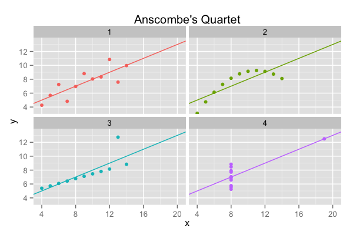

Homework 0: Anscombe's Quartet
==============================

| **Name**  | Sophie Engle |
|----------:|:-------------|
| **Email** | sjengle@usfca.edu |

## Instructions ##

The following packages must be installed prior to running this code:

- `ggplot2`
- `devtools`
- `plyr`

To run this code, please enter the following commands in R:

```
library(devtools)
source_url("https://raw.githubusercontent.com/msan622/msan622/master/homework0/anscombe.r")
```

This will generate 1 image and some text output. See below for details.

## Discussion ##

First, notice that many of the simple statistics for these four series are the same:

```R
> print(stats)
  group mean_x   mean_y var_x    var_y correlation lm_intercept lm_x_effect
1     1      9 7.500909    11 4.127269   0.8164205     3.000091   0.5000909
2     2      9 7.500909    11 4.127629   0.8162365     3.000909   0.5000000
3     3      9 7.500000    11 4.122620   0.8162867     3.002455   0.4997273
4     4      9 7.500909    11 4.123249   0.8165214     3.001727   0.4999091
```

However, when we plot these four series as scatterplots with trend lines, we can see they each have a distinct pattern:



While this is a simple (and contrived) example, it does help motivate how visualization can help us quickly see patterns in data.
