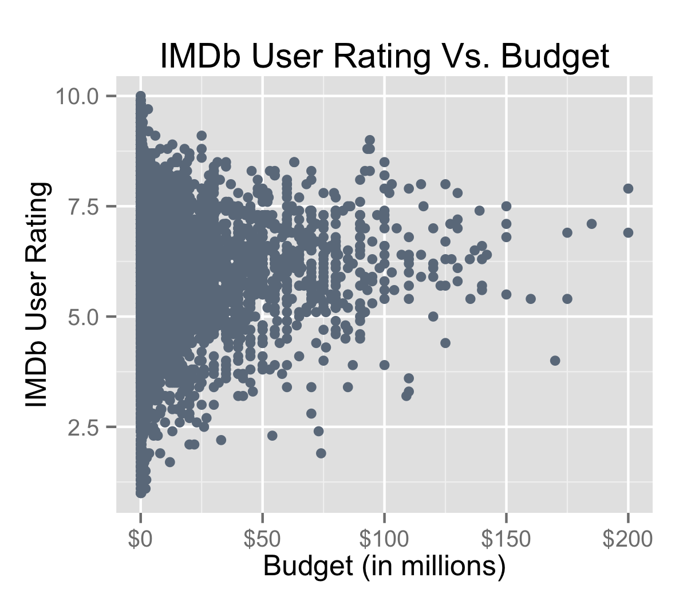
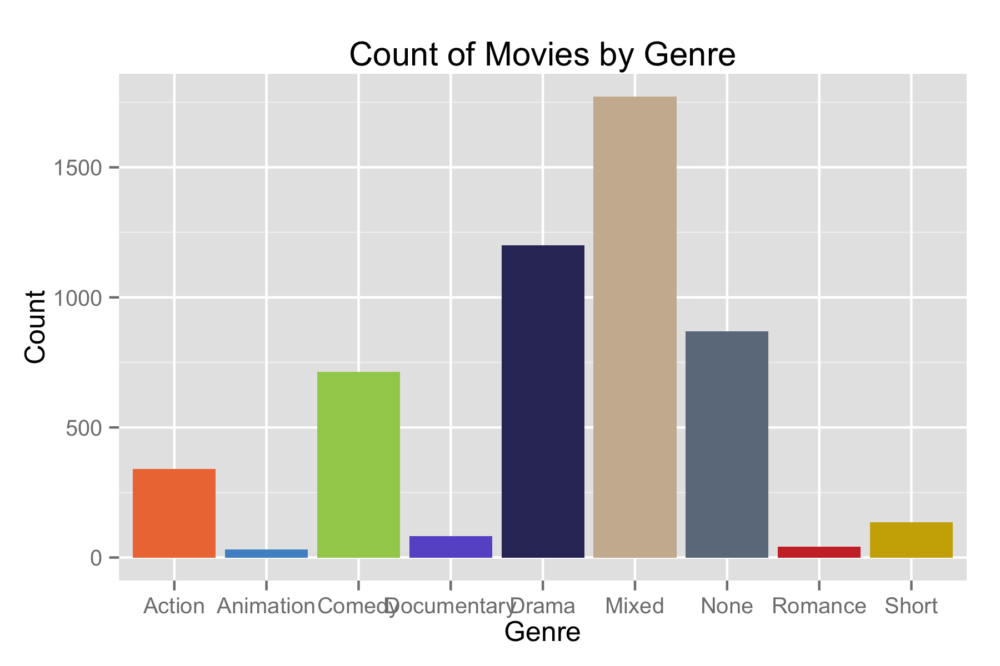
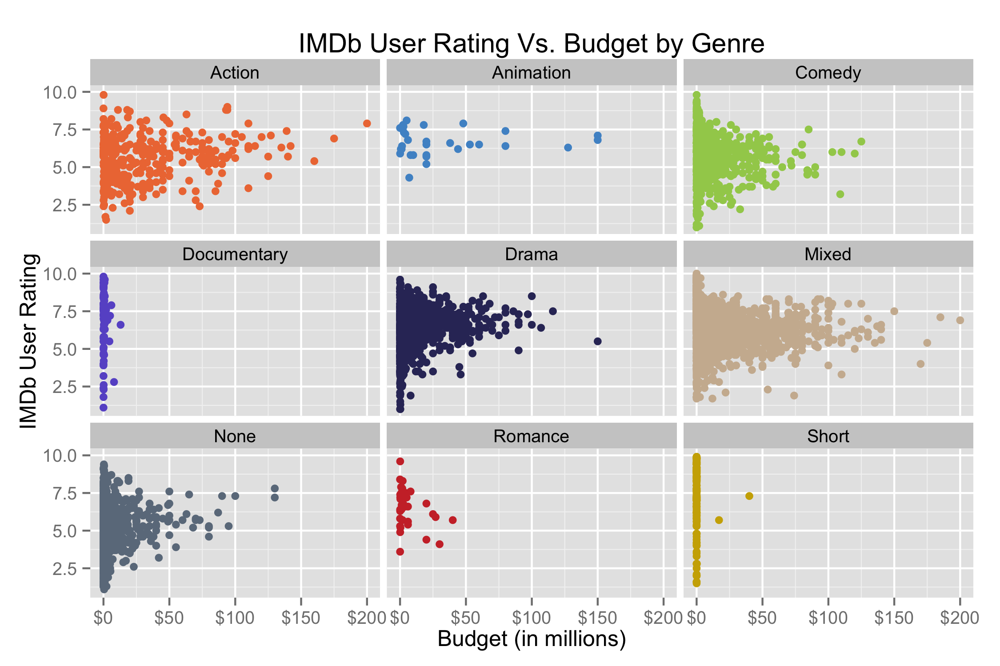
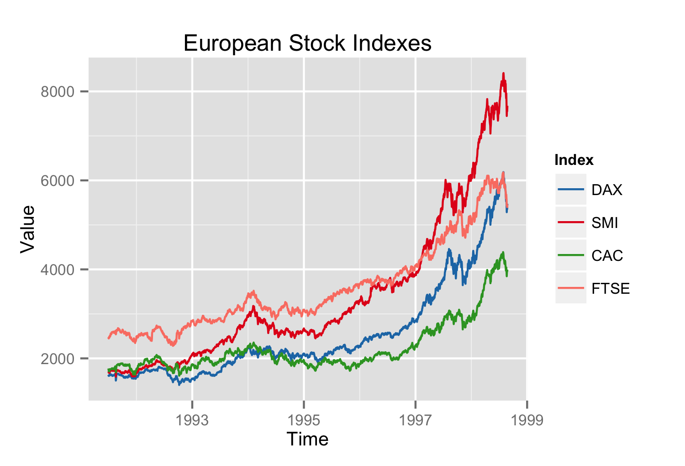

Homework 1: Basic Charts
==============================

| **Name**  | Rachel Smith  |
|----------:|:-------------|
| **Email** | rasmith2@dons.usfca.edu |

## Instructions ##
The following packages must be installed before running this code: 

+ `ggplot2`
+ `scales`
+ `reshape`
+ `grid`

This script will produce and save 4 images. 

## Discussion ##

### Scatter Plot

 In this plot, I modified the default labels for the y-axis, and transformed the labels for the x-axis. I also used the alpha parameter to make the points more transparent -- as this makes overlapping points easier to see. I edited the text size as it was showing up rather large on GitHub. I used a neutral color from my movie palette for this plot. 

### Bar Plot

 I used a little more customization in this plot. I took away the legend, axis titles, x-axis ticks, and vertical grid lines. I also increased the text size for the genre labels on the x-axis and decreased the padding of the plot. I created a custom palette based on the genres. 

### Small Multiples Plot

 I used my custom palette for the genres. I also increased the size of the space between the facets to make the x-axis labels easier to read. Again, I transformed the x-axis labels, and created custom breaks for the y-axis. 

### Multi Line Plot

 I created custom breaks for the x-axis and labeled the legend. Again, I made the text size slightly smaller. I used a colorbrewer palette for this plot. 

