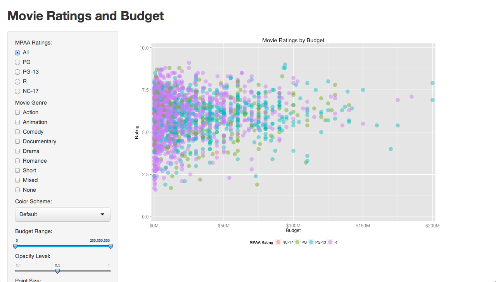

Homework 2: Interactivity
==============================

For this assignment, you will practice using `R`, `ggplot2`, and `shiny` to generate an interactive scatterplot.

:warning: Your plots may be displayed and discussed in class. Please make sure to **not** include your name on the plots themselves to protect your identity.

Setup
------------------------------

This assignment will use the `movies` dataset in the `ggplot2` package. You will need to perform some transformations of this dataset first to prepare for the visualization.

Use the following code to load the dataset:

```
library(ggplot2) 
data(movies) 
```

Then, perform the following transformations:

- Filter out any rows that do not have a valid `budget` value greater than 0. 

- Filter out any rows that do not have a valid MPAA rating in the `mpaa` column.

- Add a `genre` column to the `movies` dataset as follows:
  ```
  genre <- rep(NA, nrow(movies))
  count <- rowSums(movies[, 18:24])
  genre[which(count > 1)] = "Mixed"
  genre[which(count < 1)] = "None"
  genre[which(count == 1 & movies$Action == 1)] = "Action"
  genre[which(count == 1 & movies$Animation == 1)] = "Animation"
  genre[which(count == 1 & movies$Comedy == 1)] = "Comedy"
  genre[which(count == 1 & movies$Drama == 1)] = "Drama"
  genre[which(count == 1 & movies$Documentary == 1)] = "Documentary"
  genre[which(count == 1 & movies$Romance == 1)] = "Romance"
  genre[which(count == 1 & movies$Short == 1)] = "Short"
  ```

At this point, you are ready to start working on the visualizations.

Visualizations
------------------------------

You must create an interactive scatterplot of the `movies` dataset using the `ggplot2` and `shiny` packages. The basic scatterplot should have `budget` on the x-axis, the IMDB `rating` on the y-axis, and dots colored by the `mpaa` rating.

Then, you must add the following widgets to your `shiny` interface:

- **MPAA Rating:** Add radio buttons that allow the user to filter which MPAA ratings to view. All MPAA ratings should be shown when "All" is selected.

- **Movie Genres:** Add a checkbox group that allows the user to filter which movie genres to view. All genres should be shown when none of the checkboxes are selected.

- **Color Scheme:** Add a drop-down box that allows the user to change color schemes between "Default", "Accent", "Set1", "Set2", "Set3", "Dark2", "Pastel1", and "Pastel2". In `ggplot2`, you can change the color scheme with the code `scale_color_brewer(palette = "Pastel1")` and so on.

- **Dot Size:** Add a slider input from 1 to 10 that controls the size of the dots in the scatterplot.

- **Dot Alpha:** Add a slider input from 0.1 to 1.0 that steps by 0.1 and controls the alpha value of the dots in the scatterplot.

Below is an example interface:



Your interface does not need to match this exactly. This is just an example.

Customization
------------------------------

If you wish to earn an "A" letter grade, you must go above and beyond the requirements in the [Visualizations](#visualizations) section and produce something uniquely your own. 

For example, you could choose to add extra interactivity, tweak the plot appearance (customizing labels, grid lines, etc.), add the ability to switch to different techniques, show a sortable data table, and so on. This is your chance to try something new, and your chance to impress the instructor. 

Approximately 10% to 15% of the grade for this homework will be reserved for customization features.

Hints
------------------------------

You should keep in mind the following things while creating your visualization:

- The package documentation for `shiny` (beyond what is provided in the tutorials) can be very helpful.

- Create a function that takes a vector of genres, a MPAA rating (or "All"), color palette name, dot size, and dot alpha that generates a plot. Get this function working before you start experimenting with `shiny`.

- If you have the above function and name the choices properly in the UI, both your `shinyUI()` and `shinyServer()` functions will be small.

And, make sure you ask for help if/when you get stuck!

Discussion
------------------------------

In your discussion, show a screenshot of your visualization followed by a brief description of how to interact with your visualization.

If you choose to customize your visualizations beyond the requirements in the [Visualizations](#visualizations) section, please clearly list and discuss your customization. It is important you explain _what_ you did and _why_ you did it.

Submission
------------------------------

Place all of your `R` code in `ui.r` and `server.r`, and include it and a screenshot of your visualization in a `homework2` directory within your `msan622` repository on GitHub. Make sure to include a `README.md` file with your name, USF email, instructions on running your code, and brief discussion.

After all of the necessary files are pushed to your repository, submit a link to your `homework2` directory on Canvas.

:warning: Please note that late submissions are not accepted. GitHub shows when you modified a file, so be sure not to modify your code after the deadline!

