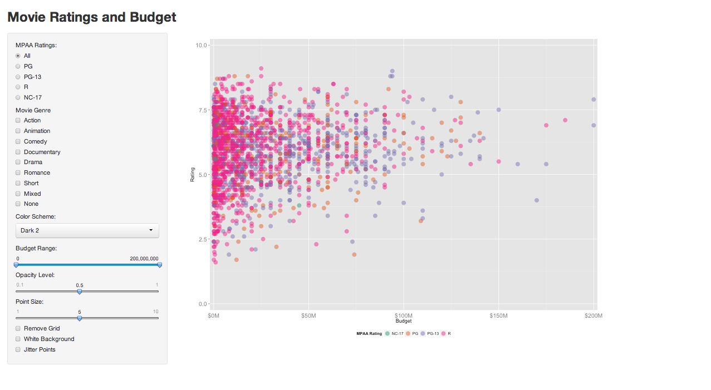

Homework 2: Interactivity
==============================

| **Name**  | Rachel Smith  |
|----------:|:-------------|
| **Email** | rasmith2@dons.usfca.edu |

## Instructions ##

The following packages must be installed prior to running this code:

- `ggplot2`
- `shiny`
- `scales`

To run this code, please enter the following commands in R:

- `library(shiny)` 
- `shiny::runGitHub('msan622', 'rasmirac', subdir = 'homework2')`

**Note**: 
It takes a few minutes to bring up the browser --  I'm not sure why. 

This will start the `shiny` app. See below for details on how to interact with the visualization.

## Discussion ##

This app offers a variety of ways for the user to interact with the visualization. One the left of the plot are options for the user to select MPAA ratings and movie genres to display. A dropdown list allows the user to choose the color scheme they prefer. There are also slider bars for selecting the budget range as well as the opacity level and size of the points. Further, the user can change the background color to white and remove the gridlines. In order for the overlapping points to be more obvious (especially for smaller budget ranges), there is also an option to 'jitter' the points. 

I made some small changes to the plot in order to make it attractive and robust to user interaction. I noticed that the budget and rating range changed when I selected genres or MPAA ratings. To avoid this, I set the x and y-axis ranges to be constant in the plots. Because I allow for changes in the budget range, I used the user specified range for the to limit the values shown on the x-axis. Further, since the expanded margin size should change with the x-range, I made the expansion a function of the range. I also wanted the plot to have a consistent color scheme for the MPAA ratings. To do this, I set the `limits` command to the full options of the *mpaa* variable in the `scale_color_manual()` option in ggplot. 

Cosmetic changes that I made include: 

+ changed the text size for the axis labels
+ moved the legend to below the plot 
+ formatted the x-axis labels to show budget in millions of dollars
+ set the display size of the plot, removed the tick marks on the slider inputs
+ removed the plot if the dataset doesn't not contain the user specified combinations of values (for example, NC-17 Animation movies). 